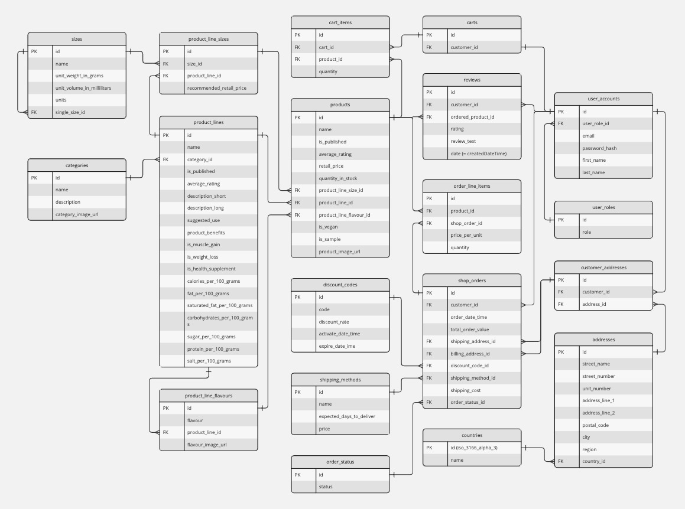

**Table of Contents**

- [Overview 🌎](#overview-)
  - [Use Cases / Features 💪](#use-cases--features-)
    - [Register as a **customer** and...](#register-as-a-customer-and)
    - [Login as an **admin** and...](#login-as-an-admin-and)
- [Getting Started 🏁](#getting-started-)
  - [Video Walkthrough 👀](#video-walkthrough-)
  - [Browse the Live Website 👩🏽‍💻](#browse-the-live-website-)
  - [Swagger UI 💬](#swagger-ui-)
  - [Clone Project and Run Locally ⚛️](#clone-project-and-run-locally-️)
- [DB Schema / ERD 🌎](#db-schema--erd-)
- [Project Architecture](#project-architecture)
  - [CA, DDD, CQRS... what does it all mean?](#ca-ddd-cqrs-what-does-it-all-mean)
  - [Folder Structure 🗂](#folder-structure-)
  - [Domain Layer](#domain-layer)
    - [Self-Documenting Code](#self-documenting-code)
    - [Rationale for strongly typed IDs as value objects](#rationale-for-strongly-typed-ids-as-value-objects)
      - [Benefits of strongly typed IDs](#benefits-of-strongly-typed-ids)
      - [Benefits of defining strongly typed IDs as value objects](#benefits-of-defining-strongly-typed-ids-as-value-objects)
    - [DDD base classes and interfaces](#ddd-base-classes-and-interfaces)
      - [The `ValueObject` base class](#the-valueobject-base-class)
      - [The `Entity` base class](#the-entity-base-class)
      - [The `AggregateRoot` base class](#the-aggregateroot-base-class)
      - [The `AggregateRootId` and `EntityId` base classes](#the-aggregaterootid-and-entityid-base-classes)
      - [The `IDomainEvent` and `IHasDomainEvent` interfaces](#the-idomainevent-and-ihasdomainevent-interfaces)
  - [Application Layer](#application-layer)
    - [Self-Documenting Code](#self-documenting-code-1)
    - [Authorization 🛂](#authorization-)
      - [Authorization Implementation](#authorization-implementation)
  - [Presentation Layer](#presentation-layer)
    - [Self-Documenting Code](#self-documenting-code-2)
    - [Contracts Project (classlib)](#contracts-project-classlib)
    - [Api Project (webapi)](#api-project-webapi)
  - [Infrastructure Layer](#infrastructure-layer)
    - [Self-Documenting Code](#self-documenting-code-3)
    - [Persistence Highlights](#persistence-highlights)
- [Global Error Handling ⚠️](#global-error-handling-️)
  - [Objectives](#objectives)
  - [Exception Handling vs. Result Pattern](#exception-handling-vs-result-pattern)
  - [Implementation](#implementation)
- [Comments DevOps \& Deployment](#comments-devops--deployment)
  - [token secret](#token-secret)
  - [ci/cd](#cicd)
- [Testing](#testing)
- [Fullstack Project](#fullstack-project)
  - [Features](#features)
    - [Mandatory features](#mandatory-features)
      - [User Functionalities](#user-functionalities)
      - [Admin Functionalities](#admin-functionalities)
    - [Bonus-point](#bonus-point)
  - [Requirements](#requirements)
  - [Getting Started](#getting-started)
  - [Testing](#testing-1)

# Overview 🌎

This is a feature-rich backend server for an ecommerce store built with ASP .NET Core 8, Entity Framework Core, and PostgreSQL as the database.

The backend project is part of a fullstack project: The frontend was built using React, Redux, Redux Toolkit, SASS and MaterialUI.

## Use Cases / Features 💪

### Register as a **customer** and...

- Browse products, filter by category, and combine sorts and filters for 8 different product attributes.
- Read and write product reviews.
- Collect items to buy in your shopping cart.
- Apply discount codes on checkout, select your shipping method, and place an order.
- Benefit from free shipping on orders over EUR 100.
- Observe your order's status.
- View your order history.
- Login, logout, change your profile details, shipping and billing addresses.

### Login as an **admin** and...

- Create, edit and delete products, categories, and product lines.
- Create discount codes, specify their discount rate, activate them and set their expiry date.
- Lower prices of single items within a product line to promote sales.
- Unpublish product lines and products from the store when they go out of stock, publish them again when they are back in stock.
- Manage inventory levels of products.
- Update order status, or cancel an order.
- Analyse your sales by querying against your database of shop orders.

# Getting Started 🏁

## Video Walkthrough 👀

## Browse the Live Website 👩🏽‍💻

Live project can be viewed at:
https://core-nutrition.azurewebsites.net

## Swagger UI 💬

Swagger UI:
https://core-nutrition.azurewebsites.net/swagger/index.html

## Clone Project and Run Locally ⚛️

# DB Schema / ERD 🌎

- ERD diagram
  

- Eraser comments

# Project Architecture

## CA, DDD, CQRS... what does it all mean?

This project was created following and aiming to integrate as well as possible the concepts, design rules, and patterns of Clean Architecture ("CA"), Domain-Driven Design ("DDD"), and CQRS ("Command-Query-Responsibility-Segregation").

This README uses a range of conceptual terms from CA, DDD, and CQRS without further explanation.

So if you are new to any of these concepts...

- **Clean Architecture:** You can read this short [introduction to Clean Architecture by Robert C. Martin](https://blog.cleancoder.com/uncle-bob/2012/08/13/the-clean-architecture.html).
- **Domain-Driven Design:** You can [watch "Domain-Driven Design in 150 Seconds" by Amichai Mantinband](https://www.youtube.com/watch?v=8Z5IAkWcnIw) on YouTubefor a quick overview of the concepts of DDD including some visualizations.
- **CQRS Pattern:** To gain an overview of this pattern in less than 5 minutes, read the [introduction to CQRS on the EventStore blog](https://www.eventstore.com/cqrs-pattern)

## Folder Structure 🗂

// CA Figma template

## Domain Layer

// Figma template only Domain

### Self-Documenting Code

If you want to jump straight into the code, here are some pointers of what can be found in the Domain Layer:

- **DDD Domain Model**
  - The `Entities` folder in the domain layer gives an [overview](./src/CoreNutrition.Domain/Entities/) of how the Aggregate Root Entities are defining and modeling the business domain
  - Within each Aggregate directory, the model for the aggregate root entity itself, as well as folders for `/Entities`, `ValueObjects`, `Events` that are contained within that aggregate give further orientation of how the business case has been modeled into the application's architecture
  - _Example:_ A quick look at the [ProductLineAggregate folder](./src/CoreNutrition.Domain/ProductLineAggregate/) reveals that...
    - ...it contains several value objects that are specific to this aggregate only (e.g. [`NutritionFacts` and `ProductLineInfo`](./src/CoreNutrition.Domain/ProductLineAggregate/ValueObjects/))
    - ...manipulation of the Aggregate Root Entity may raise [several Domain Events](./src/CoreNutrition.Domain/ProductLineAggregate/Events/)
    - ...and a closer look at the code that models the root entity (--> [ProductLine.cs](./src/CoreNutrition.Domain/ProductLineAggregate/ProductLine.cs)) indicates that
      - ...a Product Line contains several more value objects that are commonly shared by other aggregates, such as `CurrencyAmount` and `AverageRating`.
      - and that a Product Line has relations with several other aggregates, such as `Category`, `ProductLineSize`, `ProductLineFlavour`, and `Product`.

### Rationale for strongly typed IDs as value objects

The chosen approach of using _strongly typed IDs_ for _entities_ in the domain model, and also _defining those IDs as value objects_ provides several benefits in the context of DDD:

#### Benefits of strongly typed IDs

- **Type safety** prevents accidental mixing of different but similar types of IDs.
  E.g., if IDs of two different entities were expected as arguments by a method, a type annotation of `(Guid idOfEntityA, Guid idOfEntityB)` would not prevent the potential mistake of IDs being passed in the wrong order.
- **Semantic meaning**: Code becomes more expressive and self-documenting.
- **Maintainability**: If the requirements for IDs change in the future, these updates won't modify the entity itself.
- **Separation of concerns**: The entity can focus on its core responsiblities and behavior, while the ID encapsulates the logic and rules specific to identifying the entity.

#### Benefits of defining strongly typed IDs as value objects

- **Encapsulation and validation**: By encapsulating IDs within a value object, validation rules and invariants specific to that ID type are easier to enforce.
- **Equality and comparison**: The `ValueObject` base class provides a consistent implementation of equality and comparison operators (`==`, `!=`, `GetHashCode`, `Equals`).
- **Immutability**: By inheriting from `ValueObject`, strongly typed IDs are immutable by default. This aligns with DDD, where value objects and entity IDs should be immutable to maintain a consistent state and avoid unintended side effects.
- **Testability**: By encapsulating ID logic in a separate value object, unit tests for the ID's behavior can easily be written without involving the entire entity.

### DDD base classes and interfaces

To maintain the integrity of the domain model in a Domain-Driven Design (DDD) context, to promote consistency of implementation and to reduce boilerplate code, the following base classes and interfaces have been implemented:

#### The `ValueObject` base class

[TODO: LINK to source code](www.example.com)

According to DDD principles, _value objects_ are immutable objects that represent a conceptual whole, and are distinguished by their value rather than their identity.

By implementing the `GetEqualityComponents()` method of the abstract `ValueObject`class, derived value object classes can define their criteria for equality based on their specific properties and fields.

The `ValueObject` class then implements the `Equals(T other)` method from the `IEquatable<T>` interface to define its own equality comparison logic:
It checks that the provided object is not null, is of the same type as the current instance, and then compares the equality components of both objects using the `SequenceEqual()` method.

The `Equals()` method is then used internally by the overloaded `==` and `!=` operators.

#### The `Entity` base class

[TODO: LINK to source code](www.example.com)
According to DDD principles, _entities_ are mutable objects and their (in)equality comparison is based only on their unique `id` value, regardless of their other properties.

#### The `AggregateRoot` base class

[TODO: LINK to source code](www.example.com)
The `AggregateRoot<TId, TIdType>` class extends the `Entity<TId>` and represents an aggregate root, which is the primary entity in a domain model.

#### The `AggregateRootId` and `EntityId` base classes

[TODO: LINK to source code](www.example.com)

Why separate definition of AggregateRootId vs. EntityId ???

The `EntityId<TId>` class is an abstract base class for strongly-typed identities representing the unique identifier of an entity. It extends the abstract `ValueObject` class.

The `AggregateRootId<TId>` class extends `EntityId<TId>` (and thereby also `ValueObject`) and represents the unique identifier of an aggregate root.

In the `AggregateRootId<TId>` class, `base(value)` is used in the constructor to initialize the `Value` property in the `EntityId<TId>` class.

`AggregateRootId<TId>` needs to initialize the `Value` property which is defined in its base class `EntityId<TId>`, so it calls the base class constructor to do this.

#### The `IDomainEvent` and `IHasDomainEvent` interfaces

[TODO: LINK to source code](www.example.com)

- 12, 13, 16, 17
- Explain rationale for strongly typed IDs, IDs as "value objects"
- DDD, Aggregates

- Domain Modeling
- TO DO: Miro Screenshot of Domain Modeling result
- LINK TO: DomainModels folder in Docs

- ?(Domain Events: explain storming process, link to docs, result, process modeling in Wiki?)

  - v=7LFxWgfJEeI
  - Part 10
  - Aggregates as transactional boundaries / Part 17 (0:00 - ) / side effects in one transaction (9:30)

- TO DO: Expand domain model classes with events

  - Part 17; v=MhoFCy_2-wQ

- Present and explain Domain proj folder structure
  - part 13 2-3:30

## Application Layer

// Figma template

### Self-Documenting Code

If you want to jump straight into the code, here are some pointers of what can be found in the Application Layer:

### Authorization 🛂

This project supports role based authorization. The decision to apply specific authorization requirements on the commands and queries in the Application Layer (instead of on the controllers and endpoints in the Presentation Layer) aligns with Clean Architecture principles:

- The authorization logic is key to the application's use cases and business logic and thereby the responsibility of the Application Layer.
- It should be kept independent of the Presentation Layer as well as any infrastructure-specific concerns (e.g. like validating the [current user in an HTTP context](./src/CoreNutrition.Infrastructure/Security/CurrentUserProvider/)).

This design choice also has the following benefits:

1. **Separation of Concerns:** Controllers are responsible for handling the HTTP requests and responses, while the Application Layer is responsible for the business logic and authorization requirements.
1. **Reusability:** The authorization requirements defined on the commands and queries can be reused across multiple controllers or even other parts of the application. This promotes code reuse and consistency in the application's security model.
1. **Testability:** With the authorization logic encapsulated in the Application Layer, it becomes easier to write unit tests for the commands and queries without having to worry about the web-specific aspects of the application.
1. **Flexibility:** If authorization requirements change, only attributes on commands and queries need to be updated, without having to modify the controller code. This makes the application more maintainable and adaptable to changing security requirements.

In contrast, if the authorization logic were applied directly on the controller endpoints, the authorization logic would be tightly coupled to the Presentation Layer, making the application harder to test and maintain in the long run.

#### Authorization Implementation

Commands and Queries are decorated with the `[Authorize]` attribute and implement the `IAuthorizeableAction` interface.

This `IAuthorizeableAction` interface [see code]() hooks the incoming request into an additional `AuthorizationBehavior` step in the [request pipeline](./src/CoreNutrition.Application/Common/Behaviors/) (implemented with MediatR).

The `AuthorizationService` ([see code](./src/CoreNutrition.Infrastructure/Security/AuthorizationService.cs)) subsequently validates the current user's token claims against any required roles and permissions.

## Presentation Layer

// Figma template

### Self-Documenting Code

If you want to jump straight into the code, here are some pointers of what can be found in the Presentation Layer:

- A thorough overview of the implemented **Rest API** can be gained by looking at the contracts defined in

  - [ApiRoutes.cs](./src/CoreNutrition.Api/Contracts/ApiRoutes.cs) in combination with
  - ...the `CoreNutrition.Contracts` project, which is a class library containing [models for all HTTP Request and HTTP Response objects](./src/CoreNutrition.Contracts)

- **Error Handlings**:
  - The [Domain Errors](./src/CoreNutrition.Domain/Common/DomainErrors/) folder and...
  - ...the `ErrorsController` [ErrorsController](./src/CoreNutrition.Domain/Comm) give a good overview of how **Global Exception/Error Handling** was implemented.

### Contracts Project (classlib)

The Contracts project is only referenced by the Api project, and its purpose is "documentation as code".
It models the shape of Rest API requests and responses which are referenced by the API Controllers...

- ...to map incoming requests to their corresponding commands and queries in the Application Layer, as well as...
- ...to map returned results back to the appropriate response objects.

### Api Project (webapi)

## Infrastructure Layer

// Figma template

### Self-Documenting Code

If you want to jump straight into the code, here are some pointers of what can be found in the Infrastructure Layer:

### Persistence Highlights

**PublishDomainEventsInterceptor**

- Part 17

# Global Error Handling ⚠️

## Objectives

Given the context of a customer facing ecommerce shop, a Global Exception Handling solution should accomodate the following considerations:

- **Privacy/Security**: Ensure responses and logging mechanisms do not divulge sensitive information.
- **Monitoring**: Clearly distinguish between expected and unexpected exceptions for effective system monitoring.
- **Performance**: Besides slowing each individual request-response cycle that throws an exception, the computational expense associated with throwing exceptions in C# at scale needs to be taken into account (ballooning `StackTrace` objects, nested `InnerException`s putting pressure on heap and garbage collector).
- **Maintainability/Scalability**:
  - Comprehensive flow control: Exceptions can occur at various points beyond just controllers, necessitating robust handling throughout the system.
  - Anticipate the emergence of new types of errors as the system evolves, accommodating changes in scope and complexity.

## Exception Handling vs. Result Pattern

In the Result Pattern, instead of throwing exceptions to signal errors, methods return a result object that encapsulates both the successful result and any potential errors that occurred.

This is in contrast to a binary Success/Failure signalling of a thrown exception.

The Result Pattern allows a structured approach to granular custom error handling, and it can furthermore...

- **...ensure privacy and security by** allowing controlled disclosure of errors.
- **...aid in monitoring by** distinguishing between expected and unexpected exceptions (Exceptions actually become _exceptional_ again!).
- **...address performance concerns by** avoiding the overhead and mitigating the risk of ballooning resource consumption associated with exception-based approaches.
- **...facilitate comprehensive flow control, scalability, and maintainability, and accommodate evolving system requirements by** meaningfully conveying error hierarchies. and clearly discerning between technology specific exceptions, domain exceptions and domain logic.

## Implementation

**`ErrorsController`**

- A `.UseExceptionHandler("/error")` middleware, registered as the first middleware, encapsulates subsequent middleware in a try-catch-like pattern that reroutes and re-executes any request that throws an exception.

- Failing requests are directed to a dedicated `ErrorsController` that extends `Problems()` from the `ControllerBase` class so that - _unless_ the exception can be matched to a custom domain error - a generic `500 Internal Server Error` without any sensitive information is returned to the user.

- API controllers (meaning all controllers _except_ the `ErrorsController`) implement a `Problems()` method accepting a list of custom errors, mapping them to an `IActionResult` response.

**Custom implementation of `ProblemDetailsFactory`**

- A custom `ProblemDetailsFactory` overrides methods creating `ProblemDetails` and `ValidationProblemDetails` objects for consistent and customizable error handling in CoreNutrition.Api.

**Domain errors, external vs. internal "language", and Clean Architecture**

- Located in the Core/Domain Layer, all custom `DomainErrors` can be referenced and properly handled by any other component across the architecture.
- The custom domain errors are implemented using the [ErrorOr](https://www.nuget.org/packages/ErrorOr) package.
- Error types and descriptions are defined using the internal business logic and terminology. This internal error logic is only translated into HTTP status codes in the outermost layer.
- This way, error handling is not confined to the limits of speaking in the "language of HTTP status codes". Instead, the application can handle errors in the expressive language of its internal error logic. This flexibility aligns with _Clean Architecture_ principles: Changes to how errors are communicated to clients (such as switching to a different protocol, e.g. GraphQL, gRPC, WebSockets) can be made without impacting the underlying error handling logic.

# Comments DevOps & Deployment

## token secret

in .Api project in Development env --> JwtSettings:Secret in dotnet secret store

- dotnet user-secrets init
- dotnet user-secrets set "JwtSettings:Secret" "1-2-3-super-duper-mega-ultra-secret-key"
- dotnet user-secrets list

## ci/cd

CI/CD pipeline with gh actions > Azure

Publish:

Build and test:

# Testing

xunit
Moq
FluentAssertions

Testing Project structure

Testing Validation Pipeline behavior: 8/23:00

# Fullstack Project

## Features

### Mandatory features

#### User Functionalities

1. User Management: Users should be able to register for an account and manage their profile.
2. Browse Products: Users should be able to view all available products and single product, search and sort products.
3. Add to Cart: Users should be able to add products to a shopping cart, and manage cart.
4. Oders: Users should be able to place orders and see the history of their orders.

#### Admin Functionalities

1. User Management: Admins should be able to manage all users.
2. Product Management: Admins should be able to manage all products.
3. Order Management: Admins should be able to manage all orders.

### Bonus-point

1. Third party integrations, for example: Google Authentication, Sending Email, Payment gateway, etc.
2. Extra features, for examples: dynamic pricing algorithms, chatbots, subscription, admin dashboard with analytics, etc.

## Requirements

1. Project should use CLEAN architecture, proper naming convention, security, and comply with Rest API. In README file, explain the structure of your project as well.
2. Error handler: This will ensure any exceptions thrown in your application are handled appropriately and helpful error messages are returned.
3. In backend server, unit testing (xunit) should be done, at least for Service(Use case) layer. We recommend to test entities, repositories and controllers as well.
4. Document with Swagger: Make sure to annotate your API endpoints and generate a Swagger UI for easier testing and documentation.
5. `README` file should sufficiently describe the project, as well as the deployment, link to frontend github.
6. Frontend, backend, and database servers need to be available in the live servers.

## Getting Started

1. Start with backend first before moving to frontend.
2. In the backend, here is the recommended order:

   - Plan Your Database Schema before start coding

   - Set Up the Project Structure

   - Build the models

   - Create the Repositories

   - Build the Services

   - Set Up Authentication & Authorization

   - Build the Controllers

   - Implement Error Handling Middleware

3. You should focus on the mandatory features first. Make sure you have minimal working project before opting for advanced functionalities.

Testing should be done along the development circle, early and regularly.

## Testing

Unit testing, and optionally integration testing, must be included for both frontend and backend code. Aim for high test coverage and ensure all major functionalities are covered.
